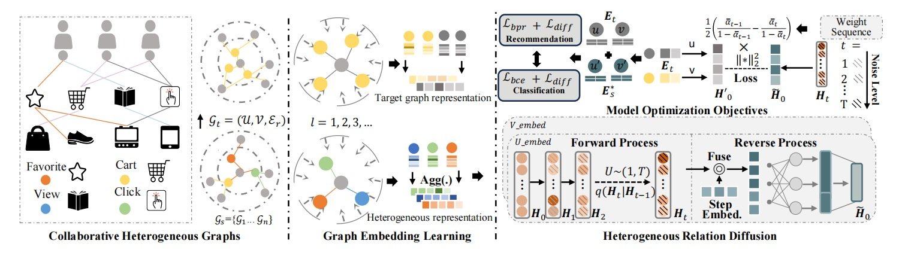

# WSDM'2025: DiffGraph: Heterogeneous Graph Diffusion Model

>Framework

## Abstract
Recent advances in Graph Neural Networks (GNNs) have signifi-
cantly improved modeling of graph-structured data. However, tradi-
tional GNNs face challenges in dealing with complex heterogeneous
structures commonly found in real-world applications. While re-
cent studies have addressed dependencies among heterogeneous
interactions, two major challenges persist: 1) Noisy data within
heterogeneous structures can impair the learning of embeddings
and negatively affect graph learning tasks; 2) Existing methods fail
to capture complex semantic transitions among heterogeneous re-
lations, impacting downstream predictions. To address these issues,
we introduce a novel framework, Heterogeneous Graph Diffusion
Model (DiffGraph), which incorporates a cross-view denoising strat-
egy. This strategy effectively transforms auxiliary heterogeneous
data into the target semantic space to distill task-relevant infor-
mation. Our approach features a latent heterogeneous graph dif-
fusion mechanism, which manages noise through an innovative
forward and backward diffusion process. This method simulta-
neously achieves heterogeneous graph denoising and cross-type
transition, and also eases the challenges of graph generation by
leveraging its latent-space diffusion process. We validated our pro-
posed framework through comprehensive experiments on both
public and industrial datasets. The evaluation results demonstrate
that DiffGraph outperforms existing methods in both link predic-
tion and node classification tasks, showcasing its robustness and
efficiency in processing heterogeneous graphs.
## Environment
- python=3.8
- torch=1.12.1
- numpy=1.23.1
- scipy=1.9.1
- dgl=1.0.2+cu113
## Code Structures
#### The folder HGDM-Rec presents the code and datasets for link prediction(Recommendation), while HGDM-NC contains the code and datasets for the node classification task.
    .
    ├──HGDM-Rec
     ├── DataHandler.py
     ├── main.py
     ├── param.py
     ├── Utils                    
     │   ├── TimeLogger.py            
     │   ├── Utils.py                             
     ├── Model.py
    ├──HGDM_NC
     ├──DataHandler.py
     ├── main.py
     ├── param.py
     ├── Utils                    
     │   ├── TimeLogger.py            
     │   ├── Utils.py
     ├── Model.py
    └── README
## Datasets
We evaluate HGDM on both the link prediction
and node classification tasks. For link prediction, we utilize three
publicly available datasets collected from real-world commercial
platforms: Tmall, Retailrocket, and IJCAI. For the node classifi-
cation task, we use two public datasets, DBLP and AMiner, which
focus on publications and academic social ties, as well as an Indus-
try dataset for user classification collected from a popular game
platform. Statistics of these datasets are in Table 1. Below is the
detailed descriptions for the experimental datasets.

| Dataset       | User \# | Item \# | Link \#    | Interaction Types               |
|---------------|---------|---------|------------|---------------------------------|
| Tmall         | 31882   | 31232   | 1,451,29   | View, Favorite, Cart, Purchase  |
| Retail Rocket | 2174    | 30113   | 97,381     | View, Cart, Transaction         |
| IJCAI         | 17435   | 35920   | 799,368    | View, Favorite, Cart, Purchase  |
| Industry      | 1M      | 361     | 23,890,445 | Purchase, Friend, Complete Task |

|  | Node | Metapath |  | Node | Metapath |
|---|---|---|---|---|---|
| DBLP | Author:4057 | APA | AMiner | paper:6564 | PAP |
|      | Paper:14328 | APCPA |      | author:13329 | PRP |
|      | Conference:20 | APTPA |    | Reference:35890 | POS |
|  | Term:7723 |  |  |  |

